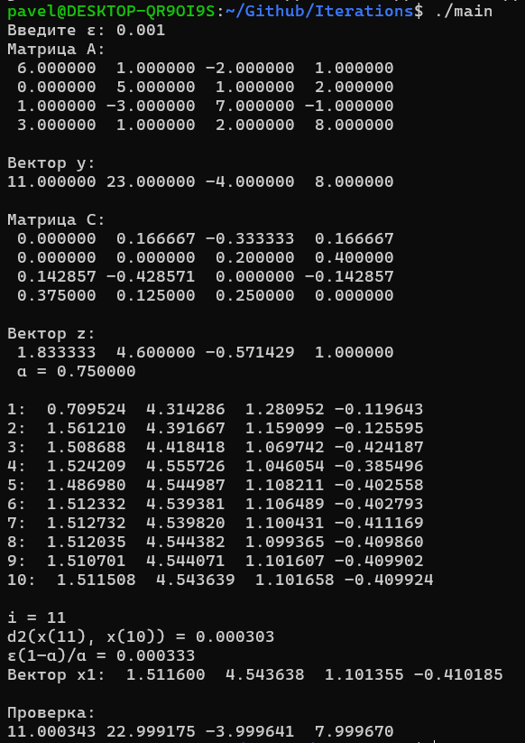
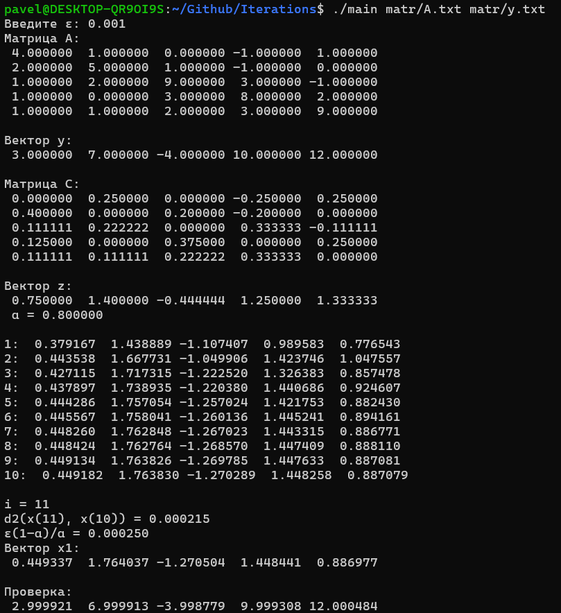
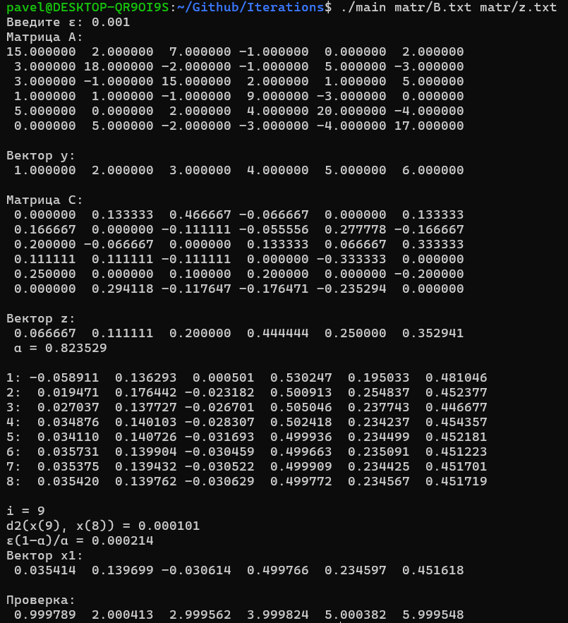

# Решение системы линейных уравнений

## О программе

*Написать программу решения системы **n** линейных уравнений **Ax = y** с **n** неизвестными методом итераций. Программа должна*

1. *преобразовать систему к виду **x = y - Bx***
2. *оценить коэффициент сжатия = операторную норму **B***
3. *начиная с **x(0)**, сделать столько итераций, чтобы получить ответ с погрешностью*
    
    *меньше **ε**, заданного с клавиатуры.*
    

## Теория

## Как запустить (linux)

*Для запуска программы небходимо:*

1. `make`
2. `./main`
3. *Вывод →*

> На рисунке видна матрица **A** и вектор **y**.  Найдена *матрица* **C,** *вектор* **z** и *коэффициент сжатия **α.***
> 
> 
>    Запускаем *итерационный процесс*, начиная с **x = z**. Пусть мы хотим найти решение с погрешностью ***ε***<0,001. Надо добиться, чтобы **d(x(m), x(m-1)) < ε(1–α)/α = 0,001(1–3/4)/(3/4) = 0,00033(3)**.
> 
>    Получаем вектор **x**, после чего **проверяем**: перемножим матрицу **A** на вектор **x**, в итоге доджны получить *изначальный вектор* **y** с точностью ***ε**.*
> 

*Можно записать матрицу и вектор с помощью файлов, тогда необходимо:*

1. `make`
2. `./main matr/A.txt matr/y.txt`
3. *Вывод →*

1. `make`
2. `./main matr/B.txt matr/z.txt`
3. *Вывод →*

